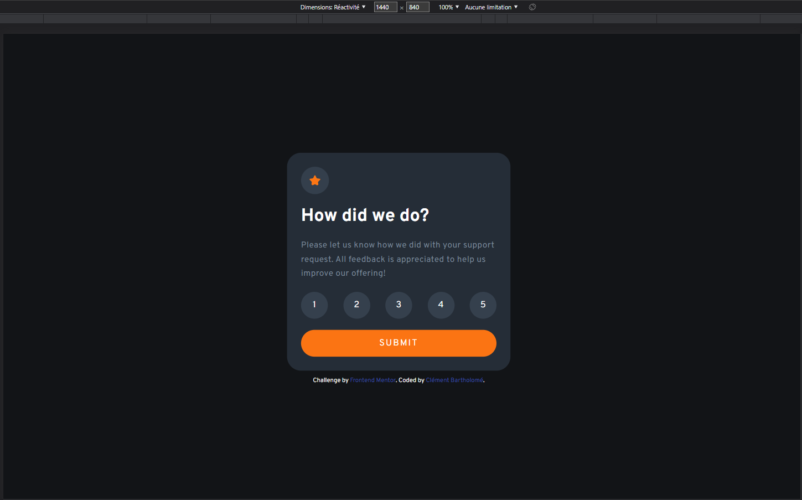
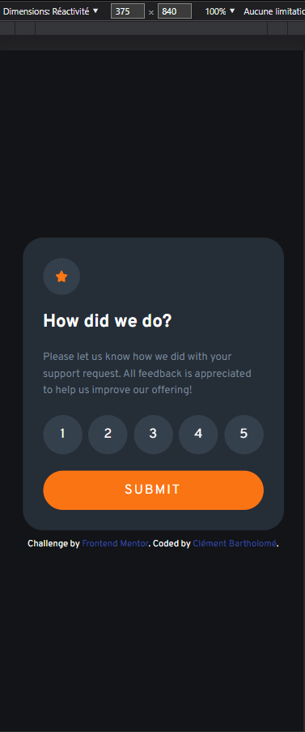
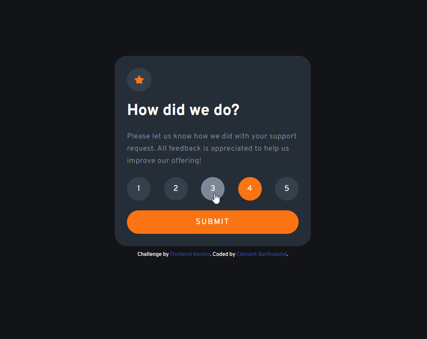
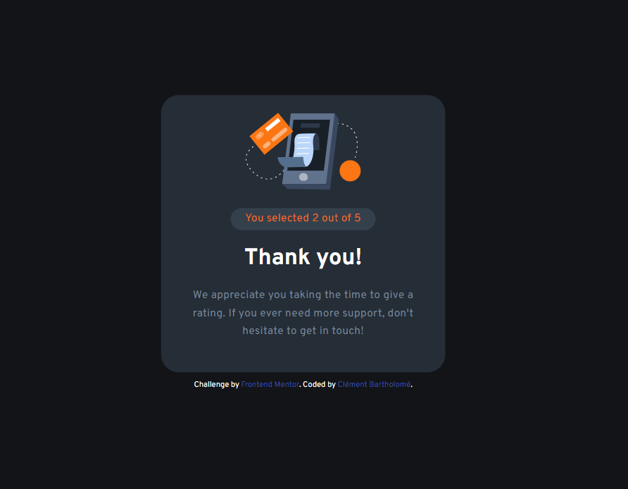

# Frontend Mentor - Interactive rating component solution

This is a solution to the [Interactive rating component challenge on Frontend Mentor](https://www.frontendmentor.io/challenges/interactive-rating-component-koxpeBUmI). Frontend Mentor challenges help you improve your coding skills by building realistic projects. 

### The challenge

Users should be able to:

- View the optimal layout for the app depending on their device's screen size
- See hover states for all interactive elements on the page
- Select and submit a number rating
- See the "Thank you" card state after submitting a rating

### Screenshots

### Links

- Solution URL: [Frontend Mentor](https://www.frontendmentor.io/solutions/interactive-rating-component-MuZVGbtjgI)
- Live Site URL: [GitHub Pages](https://clementbartholome.github.io/Interactive-Rating-Component/)

### Built with

- HTML
- CSS, Flexbox
- JavaScript

### What I learned

With this project, I learned to use the classList property, the preventDefault() method and the forEach() method.

### Useful resources

- [freeCodeCamp](https://www.freecodecamp.org/learn/) - Great ressource to learn HTML, CSS, JS and more for free. 
- [Scrimba](https://scrimba.com/) - Another ressource I recommend to learn coding for free. 

## Author

- LinkedIn - [Clément Bartholomé](https://www.linkedin.com/in/clementbartholome/)
- Frontend Mentor - [@ClementBartholome](https://www.frontendmentor.io/profile/ClementBartholome)
